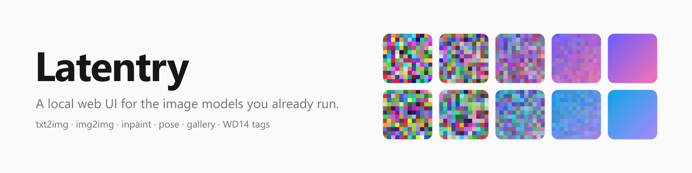
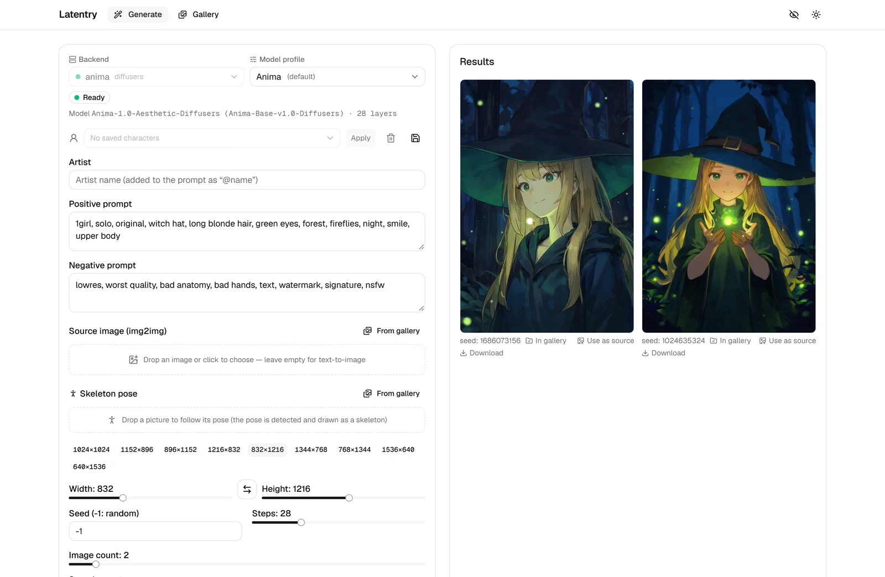
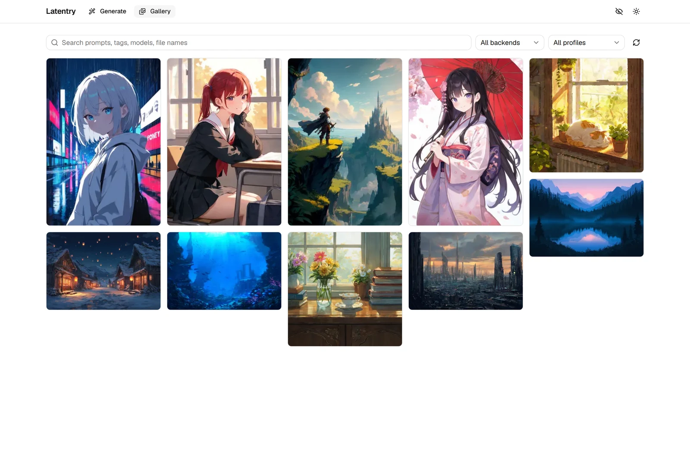
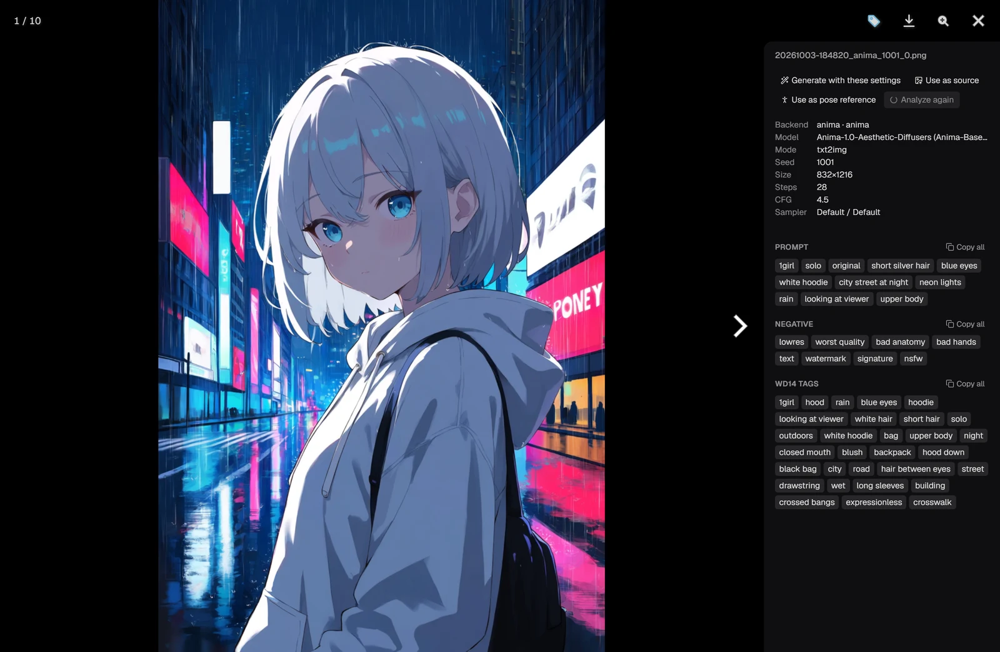

<picture>
  <source media="(prefers-color-scheme: dark)" srcset="docs/assets/banner-dark.png">
  
</picture>

# Latentry

A local web UI for the image models you already run. One form for
text-to-image, img2img, inpainting and pose, in front of several backends at
once: an Anima server and an SDXL web UI side by side, each with its own
settings. Plus a gallery that knows how every picture was made, and WD14
tagging in both directions.

## What it does

- **Generate.** Text-to-image, img2img (variation, or a picture as a pose
  reference), inpainting with a painted mask, and skeleton pose control where
  the backend supports it: pick whose pose in a group picture, and turn it in
  3D before generating (with [poseorbit](https://github.com/33rd-kk/poseorbit)).
  Runs live on the server, so a reload or a second tab picks up a run in
  progress.
- **Several backends, several model families.** Each backend keeps its own
  form. A *profile* (Anima, SDXL, Illustrious / NoobAI, Pony, generic) sets
  sizes, steps, CFG, negative prompt, artist notation and quality tags. Change
  it any time.
- **Gallery.** Every finished image is saved with its settings embedded
  (readable by A1111's PNG Info too). It also browses other folders
  read-only, such as ComfyUI or web UI outputs, and reads their metadata.
  Search, filter by backend or profile, and send settings, tags or the
  picture itself back to the form.
- **Tags.** Extract WD14 tags from a source image and carry a character's
  look into the prompt by group (hair, eyes, outfit…). Show tags under every
  gallery card, tag one picture or a whole selection at once, and keep the
  tags in the file. Tagging runs inside Latentry (on the CPU, with a WD14
  model you download), or on a backend that has a tagger.
- Light and dark, and a secret mode that keeps what you type out of browser
  storage and blurs the gallery. The UI is in English and can be machine
  translated into other languages (see [Translations](#translations)).

### Screenshots







<sub>The pictures were generated with Anima through Latentry, from original
prompts (no named characters or artists).</sub>

## Backends

| Kind | What | Notes |
|---|---|---|
| Latentry's engine | Installed and run by Latentry itself, one per NVIDIA GPU ([engine/](engine/README.md)) | Stock diffusers. SDXL family: img2img, inpaint, pose. Anima: img2img, pose (v1.0). 3D pose turning. |
| `diffusers` | Any server speaking the small HTTP API in [docs/backend-api.md](docs/backend-api.md) | img2img, inpaint, pose (if the server offers it), precise cancel |
| `a1111` | AUTOMATIC1111 or Forge started with `--api` | img2img, inpaint. No pose control. |

Use the built-in engine, the servers you already run, or both.

## Getting started

Requires Node.js 22.12 or newer.

```bash
git clone https://github.com/33rd-kk/latentry.git
cd latentry
./install.sh                                         # Linux, macOS
powershell -ExecutionPolicy Bypass -File install.ps1 # Windows
```

The script installs and builds the web UI and starts it. When it says
Ready, open **http://localhost:3000/setup** in your browser. There, in order:

1. **Install the engine.** Latentry looks at your GPU and installs Python
   3.12, the matching PyTorch build (CUDA 13.0 / 12.8 / 12.6 by driver, Apple
   Metal, or CPU), stock diffusers and its engine, all under `.runtime/` in
   the app folder. About 3–4 GB, a few minutes. Delete `.runtime/` to remove
   it.
2. **Download a model.** Each is fetched from its publisher on Hugging Face
   after you accept its license, which the page shows first (some are
   non-commercial). Or put your own SDXL `.safetensors` files in `models/`.
3. **Download a tagger** for reading tags from pictures (WD14, Apache-2.0).

Then **Generate**. The engine starts with Latentry from then on (turn that off
on the Setup page or with `LATENTRY_ENGINE=off`); start Latentry with
`npm start`.

Latentry listens on this computer only. To use it from a phone or another
computer, add `LATENTRY_HOST=0.0.0.0` to `.env.local`, restart it, and open
`http://<this computer's address>:3000` there; on Windows, allow Node.js
through the firewall on private networks when asked.

### Using servers you already run

List them in `.env.local` (copied from [.env.example](.env.example)) or add
them under **Settings**. A minimal `.env.local`:

```bash
GEN_BACKENDS=sdxl|a1111|http://localhost:7860|illustrious
GALLERY_SAVE_DIR=./output
```

Two backends, one of them protected:

```bash
GEN_BACKENDS=anima|diffusers|http://localhost:7865|anima;sdxl|a1111|http://localhost:7860|illustrious
GEN_TOKEN_SDXL=user:password
GALLERY_SAVE_DIR=D:\pictures\latentry
GALLERY_DIRS=D:\ComfyUI\output
```

Every variable is described in [.env.example](.env.example). For development,
`npm ci && npm run dev` works as before.

You can also configure everything from **Settings** in the app: backends
(with a connection test), the save folder and other gallery folders, the
WD14 tagger, and each model profile's default size, steps, CFG, negative
prompt, quality tags and artist notation. Changes are saved to
`latentry.settings.json` and apply immediately; anything not set there falls
back to `.env.local`.

## Things to know

- **The gallery reads folders on the machine running Latentry.** Backends can
  live elsewhere on the network, but `GALLERY_SAVE_DIR` and `GALLERY_DIRS`
  must be local (or a mounted share). Folders are set in `.env.local` only,
  never from the browser.
- **Images are saved twice** if your backend also saves its own copy.
  Latentry's copy is the one with the settings embedded. Turn the backend's
  saving off if you do not want both.
- **One run per backend at a time.** Different backends run in parallel; with
  two GPUs, Latentry runs an engine on each.
- **Models are never part of Latentry.** The Setup page downloads only what
  you pick, after showing its license. NoobAI XL, for one, is non-commercial.
- **Settings can only be changed on the machine running Latentry**
  (`http://localhost`). Other devices see the app but not the settings page.
  `SETTINGS_EDIT=lan` allows it from the network, `SETTINGS_EDIT=off` turns it
  off. Since settings choose which folders are read and written, only open
  this up on a network you trust: the localhost check relies on headers a
  program (not a browser) could forge.
- **It is meant for your own machine or LAN.** It listens on 127.0.0.1
  unless `LATENTRY_HOST` says otherwise. `/api` only answers for
  `localhost` and private-network addresses (add others with
  `ALLOWED_HOSTS`), refuses cross-site requests, and rate-limits per IP.
  There is no login. To expose it further, put an authenticating reverse
  proxy in front of it, one that overwrites `X-Forwarded-For` (the per-IP
  limits trust that header).

## Translations

English (`locales/en.json`) is the only catalog in the repository and the
source for every other one. To add a language, connect a machine translation
service or an LLM as a provider in `scripts/translators/` (a few lines; see
[its README](scripts/translators/README.md)) and run:

```bash
TRANSLATOR=<provider> npm run i18n:translate -- de    # writes locales/de.json
npm run i18n:check                                     # missing / stale / broken keys
```

Placeholders such as `{count}` are protected from the translator, only new or
changed English strings are sent on later runs, and a key missing from a
catalog shows in English. Browsers whose language has a catalog get it
automatically, and a language menu appears in the header once there is more
than one.

## Development

```bash
npm run typecheck
npm run lint
npm test          # verify scripts in __tests__/, no test framework needed
npm test -- gallery   # just the ones whose name contains "gallery"
```

Layout:

- `lib/backends/`: adapters (`diffusers.ts`, `a1111.ts`) behind one interface
- `lib/profiles/`: model profiles and prompt composition
- `lib/diffusion/job-store.ts`: one live run per backend
- `lib/gallery/`: PNG metadata, saving, folder access
- `lib/settings/`: the settings file, its validation, and who may edit it
- `lib/tagger/`: the built-in WD14 tagger and the choice between it and a backend's
- `app/api/gen/*`, `app/api/gallery/*`: the routes the page talks to
- `components/generate/`, `components/gallery/`: the two pages
- `components/pose3d/`: the 3D pose viewer (three.js only)
- `engine/`: the bundled generation server
- `poseorbit/`: a copy of [poseorbit](https://github.com/33rd-kk/poseorbit),
  which finds people, turns their pose in 3D and draws skeletons. Change it
  there first, then copy it here; the engine installs this copy.
- `locales/`, `scripts/i18n-translate.mjs`: UI text and the translation tool

## License

[MIT](LICENSE). The bundled [poseorbit/](poseorbit/) is Apache-2.0 (its own
LICENSE and NOTICE). Models downloaded at run time keep their licences; the
Anima pose adapter in particular is non-commercial (see [engine/](engine/README.md)).
