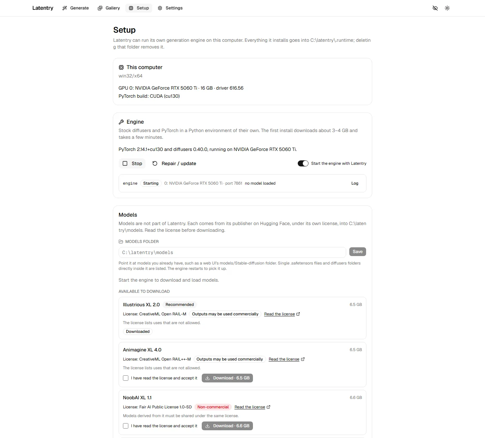

# Setup and the engine

Latentry can run its own generation engine: stock diffusers and PyTorch in a
Python environment of their own. The **Setup** page installs and runs it.
Setup can only be changed from the computer Latentry runs on.

## This computer

The GPUs found (name, memory, driver) and the PyTorch build that will be
installed for them: CUDA 13.0, 12.8 or 12.6 by driver, Apple Metal, or CPU.
Without an NVIDIA GPU the engine runs on the CPU, which takes minutes per
picture.

## Engine

- **Install the engine**: gets uv, Python 3.12, PyTorch (the large part),
  diffusers and the engine, then checks the GPU from Python. About 3–4 GB,
  a few minutes. Everything goes into `.runtime/`; deleting it removes the
  engine.
- **Repair / update**: run it after updating Latentry, or when the engine
  will not start.
- **Start** / **Stop**, and **Start the engine with Latentry**. One engine
  runs per NVIDIA GPU, each with its port, state, loaded model and **Log**.

The engine decides once at start how to use the GPU, from the memory that
is free then:

| Free VRAM | Batch | Offload |
|---|---|---|
| 11.5 GB and up | 2–8 images at once | none |
| 7–11.5 GB | 1 | model offload to RAM |
| below 7 GB | 1 | sequential offload |

When it runs out of memory, it halves the batch and tries again.

## Models

Models are not part of Latentry. Each comes from its publisher on Hugging
Face, under its own licence, into the **models folder**:

- **In the models folder**: what is there now; **Load** one, or see which is
  loaded. Single `.safetensors` files and diffusers folders are listed.
- **Available to download**: the licence, whether outputs may be used
  commercially, and a box to accept the licence before **Download**.
- **Models folder**: point it at models you already have, such as a web UI's
  `models/Stable-diffusion` folder.

The engine runs SDXL-family checkpoints (SDXL, Illustrious, NoobAI,
Animagine, Pony…) with txt2img, img2img, inpainting and pose, and Anima with
txt2img, img2img and pose (v1.0 models). The pose models download on first
use into `models/controls/`; Anima-Control-Pose is non-commercial, as Anima
itself is.

## Tagger

The WD14 tagger reads tags from pictures. It runs inside Latentry, on the
CPU, so it needs no engine. Download one here and **Use this one**.
