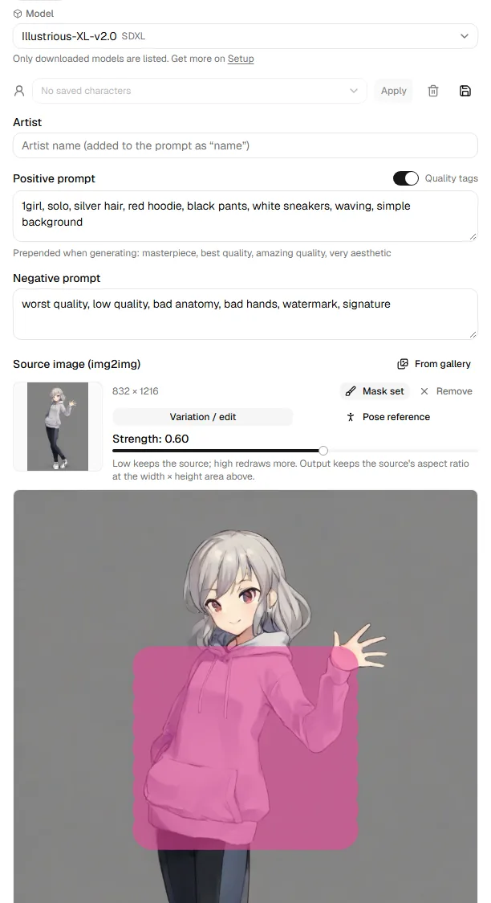

# Generate

The form on the left, the results on the right. Each backend keeps its own
form, so switching backends and back keeps what you typed.

## Backend, profile and model

- **Backend**: where the picture is made. A dot shows whether it is ready,
  busy or offline.
- **Model profile**: the model family the form is set up for (Anima, SDXL,
  Illustrious / NoobAI, Pony, generic). It fills sizes, steps, CFG, negative
  prompt, quality tags and how an artist is written. Change it any time;
  defaults per profile are set on [Settings](settings.md).
- **Model** (built-in engine): which downloaded model the engine has loaded.
  Picking another loads it; get more on [Setup](engine.md).

## Prompts

- **Artist**: a name, added to the prompt the way the profile writes it
  (for example `@name` or `by name`).
- **Positive prompt** and **Negative prompt**.
- **Share across backends**: by default each backend's form remembers its own
  prompt. Turn this on and every backend shows the same prompt and artist,
  so switching backends keeps your words and only the settings change. Turn
  it off to get each backend's own prompt back. The negative prompt is always
  per backend, because what to avoid depends on the model.
- **Quality tags**: when on, the profile's quality tags (shown under the
  prompt) are put in front when generating.
- **Tag spelling**: write tags either way, `long_hair` or `long hair`. When
  you generate, both prompts are sent in the spelling the profile's model
  family was trained on. A prompt or tags sent from the gallery arrive in that
  spelling too. Score tags, face tags such as `^_^`, LoRA calls, `BREAK` and
  sentences are left as written. Change this per profile on
  [Settings](settings.md).
- **Saved characters**: save the tags that make a character, together with
  the artist, negative prompt and seed, and apply them to any form later.

## Source image: img2img and inpainting

Drop a picture on **Source image (img2img)**, choose one **From gallery**, or
use **Use as source** under a result. Then choose what it is for:

- **Variation / edit**: the picture is redrawn. **Strength** decides how much:
  low keeps the source, high redraws more. The output keeps the source's
  aspect ratio at about the width × height area set below.
- **Pose reference**: the reference's composition and silhouette carry over,
  the rest is redrawn (strength starts at 0.85). For exact limbs, use the
  [skeleton pose](pose.md) instead.

### Inpainting: redraw only part of it

{ width="420" }

Press **Draw mask** and paint over what should change: only the painted area
is redrawn, everything else stays exactly as the source. **Brush**,
**Eraser**, **Clear** and the brush size are under the picture. Strength
around 0.6–0.8 works best; near 1.0 the painted area ignores the source and
stops fitting its surroundings.

### Tags from the source

**Extract tags** reads the source's WD14 tags (a tagger must be set up; see
[Settings](settings.md)) and sorts them into groups: character, hair, eyes,
body, outfit, expression, pose, scene. Character groups start selected; click
a tag or a group name to toggle, then **Add to prompt**. For a pose
reference, only the pose group starts selected, so the reference's hair or
outfit does not carry over.

## Size, steps and the rest

- Size buttons (1024×1024, 832×1216…) and the **Width** / **Height** sliders;
  the arrows swap them. Some profiles want multiples of 16.
- **Seed**: -1 for random (the button sets it); a fixed seed repeats a
  picture. With several images, each takes the next seed.
- **Steps**, **Image count**, **Sampler**, **Scheduler** and **Guidance
  scale** (CFG). Backends with speed presets show **Speed preset** instead of
  sampler and steps; **Custom** brings them back.
- **Reset** (the arrow next to Generate) puts this backend's form back to the
  profile's defaults.

## Results

Progress shows overall and per image. Each finished picture has:

- **In gallery** (it was saved), **Use as source**, **Download**.
- Click it to view it full screen.

One run per backend at a time: a second click while it runs shows the run
already in progress. **Cancel** stops it. Runs live on the server, so
reloading the page, or opening it in another tab, picks up a run in progress.

## Secret mode

The eye in the header turns on secret mode: nothing you type is remembered
in the browser, and the gallery blurs thumbnails and hides prompts. Turn it
off to save forms again.
