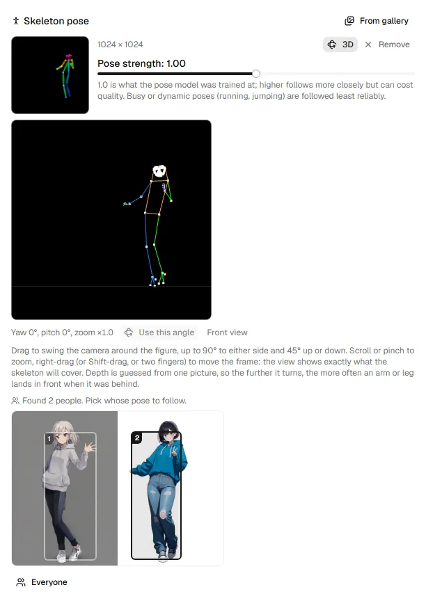

# Pose and the 3D view

**Skeleton pose** makes the run follow a pose taken from a picture: the
backend detects the people in it, draws the chosen person's skeleton, and
generates along it. It needs a backend that offers pose control: the
built-in engine (SDXL models and Anima v1.0) or a server that implements it
(see the [backend API](../backend-api.md)).

## Take a pose from a picture

Drop a picture on **Skeleton pose**, choose one **From gallery**, use **Use
the source's pose** when a source image is set, or **Use as pose reference**
in the gallery viewer. The skeleton the run will follow appears at once, drawn
for the output's size.

**Pose strength** is how closely it is followed: 1.0 is what the pose model
was trained at; higher follows more closely but can cost quality. Busy or
dynamic poses (running, jumping) are followed least reliably.

## Choose whose pose

{ width="440" }

With several people in the picture, their boxes are drawn over it, numbered
left to right. Click one to follow that person, or **Everyone** for the whole
group. The run sends only the skeleton, so the people's looks do not carry
over.

## Turn it and frame it in 3D

Press **3D** to open the 3D view. It has the output's shape and shows exactly
what the skeleton will cover.

| To | Do |
|---|---|
| Swing the camera around the figure | Drag (up to 90° to either side, 45° up or down) |
| Zoom in or out | Scroll, or pinch (×0.5 to ×6) |
| Move the frame | Right-drag, Shift-drag, or drag with two fingers |

The angle and zoom show under the view. Press **Use this angle** to have the
skeleton drawn from there; **Front view** goes back. The skeleton's
thumbnail then says "Seen from yaw …".

Zooming in turns a full-body reference into an upper-body or face close-up;
zooming out leaves room around the figure.

!!! note "Things to know"
    - Depth is guessed from one picture, so the further it turns, the more
      often an arm or leg lands in front when it was behind.
    - Some models draw a strongly turned figure from behind. Turn away from
      the side the figure already shows, keep the turn moderate, and put
      "front view" in the prompt and "from behind" in the negative.
    - With an SDXL model, the skeleton is body only. In a close-up a warning
      says how few body joints are left in the frame: the model has little
      to follow.
    - If you change the output size after drawing a skeleton, it is fitted
      inside; **Detect again** lines it up.

The detection, 3D turn and drawing are
[poseorbit](https://33rd-kk.github.io/poseorbit/), which can also be used on
its own.
