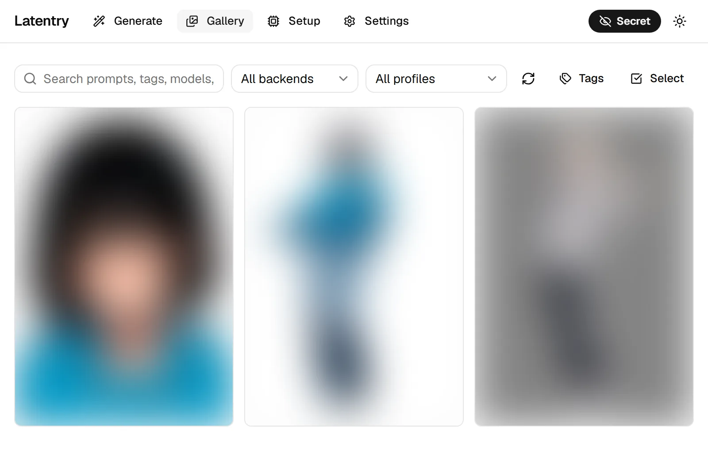
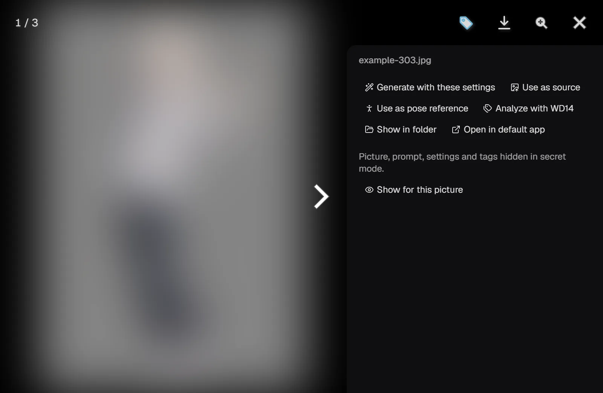

# Secret mode

Secret mode keeps what you work on out of sight and out of this browser's
memory: for when someone may look over your shoulder, or the computer is
shared. It is a setting of one browser, not a lock: read
[What it does not do](#what-it-does-not-do) before relying on it.

## Turning it on and off

Click the eye at the top right. While secret mode is on, the button is a
filled **Secret** pill with a crossed-out eye, on every page; off, it is a
plain eye. Click it again to turn it off.

The setting is remembered by this browser, so a reload keeps it. Another
browser, or another device, has its own setting.

## What it does

**Nothing you type is kept in the browser.** The generate form, the prompt
shared across backends and saved characters are not written to the
browser's storage while secret mode is on. They stay on screen until you
leave the page. What you typed *before* turning it on is kept as it was.

**The gallery hides what is in it.**

- Thumbnails in the gallery and in the gallery picker (when choosing a
  source picture) are blurred, and their captions and tags are hidden.
- Opening a picture shows it full size, but the side panel hides its
  prompt, settings and tags. **Show for this picture** reveals them while
  that picture stays on screen. Moving to another picture hides them again,
  and so does coming back to it.
- **Analyze with WD14** still works and saves the tags into the file. The
  panel says how many tags it found instead of listing them.

**Settings sent from the gallery stay in this tab.** **Generate with these
settings**, **Use as source** and tags sent to the prompt reach the form in
the same tab, not in another tab, and are not stored on the way.

**A run belongs to the page that started it.** Normally a run lives on the
server, so a reload, another tab or another device picks it up. In secret
mode it is shown only on the page that started it. If that page is
reloaded, the run carries on and its pictures are still saved, but the page
does not pick it up again. The server forgets the run, images and prompt,
a minute after it ends.

**Pictures are not kept in the browser's cache.** This is true in either
mode: gallery pictures and thumbnails are fetched again each time instead
of being stored on disk by the browser.

## What it does not do

These are by design:

- **Pictures are still saved** to the gallery folder, with their prompt and
  settings inside the file, as in normal mode.
- **The gallery shows them like any other picture**, prompt included, to
  anyone who can open it without secret mode: another browser on this
  computer, or another device when Latentry is
  [open to the network](network.md). The server cannot tell who is asking
  for the gallery.
- **The backend sees everything it is sent.** What an A1111 / Forge or
  other server does with prompts and pictures is up to that server.
- The page you are on shows what you are doing: the form, the results, and
  any picture you open full size.

To keep a picture out of the gallery, move or delete its file from the
gallery folder.
