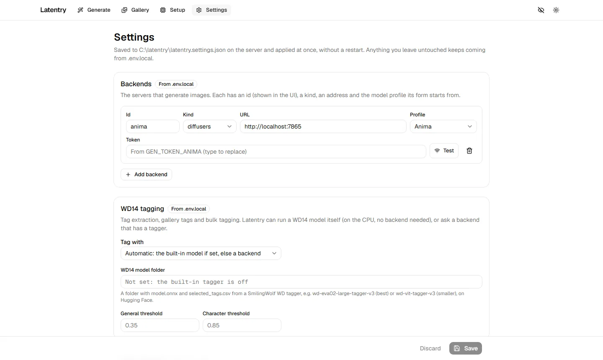

# Settings

Everything here is saved to `latentry.settings.json` on the server and
applies at once, without a restart. What you leave untouched keeps coming
from `.env.local`; a section's badge says which it uses ("Set here" or
"From .env.local"), and **Use .env.local instead** goes back.

By default, settings can only be changed on the computer running Latentry
(opened as `http://localhost`); see [Other devices and security](network.md).

## Backends

The servers that generate images. Each has:

- **Id**: what the UI calls it (a–z, 0–9, `-`, `_`).
- **Kind**: `diffusers` (a server speaking the [backend API](../backend-api.md))
  or `a1111` (AUTOMATIC1111 / Forge with `--api`).
- **URL**: where it listens.
- **Profile**: the model profile its form starts from.
- **Token**: a Bearer token for `diffusers`, `user:password` for `a1111`
  started with `--api-auth`. Saved tokens are never shown again; type to
  replace one. A token is only sent to the server it was saved for: changing
  the URL to another host, port or scheme asks for the token again. A
  `GEN_TOKEN_<ID>` from `.env.local` likewise applies only while
  `GEN_BACKENDS` lists that id at the same address.

**Test** checks the address and shows the loaded model. Latentry's own engine
is not listed here; it comes from [Setup](engine.md).

## WD14 tagging

What reads tags (tag extraction, gallery tags, bulk tagging): **Tag with**
the built-in model (Latentry runs it on the CPU) or a backend that has a
tagger. The built-in model needs a folder with `model.onnx` and
`selected_tags.csv` from a SmilingWolf WD tagger, which Setup can download.
**General threshold** and **Character threshold** set how sure a tag must be.

## Gallery folders

- **Save folder**: every finished picture is saved here with its settings;
  created if missing. Empty: pictures are not saved (download them one by
  one).
- **Other folders (read-only)**: other tools' output to browse. Latentry
  never writes to these.
- **Tag every saved image with WD14 as it arrives.**

The browser never sees these paths; it only names folders by number.

## Model profile defaults

What a form starts from for each model family: width, height, steps, CFG,
negative prompt, quality tags and artist notation (`{artist}` stands for the
name, for example `by {artist}`; `-` hides the artist field). Empty boxes use
the built-in value shown in grey. Changes apply to new forms, a profile switch
and a form reset.

**Tag spelling** and **Never respell** take effect on the next generation:

- **Tag spelling** is how the family writes the words in a tag: underscores
  (`long_hair`; built in for SDXL, Illustrious / NoobAI and Pony), spaces
  (`long hair`; Anima) or as typed (generic).
- **Never respell** lists the tags that are always left exactly as written,
  comma-separated. `*` matches anything, so `score_*` (the built-in value)
  covers `score_9` and `score_8_up`. `-` keeps nothing.

**Save** keeps the changes; **Discard** drops them.
